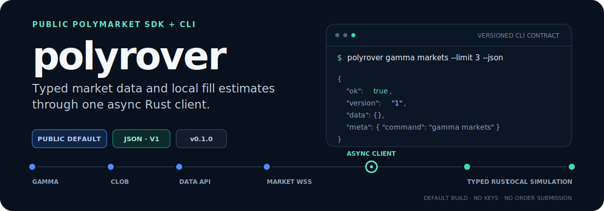
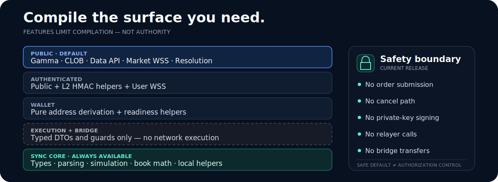

<p align="center">
  
</p>

<p align="center">
  <a href="#quick-start">Quick start</a> ·
  <a href="#public-surface">Public surface</a> ·
  <a href="#use-it-as-a-library">Rust API</a> ·
  <a href="#capability-layers">Capabilities</a> ·
  <a href="#safety-boundary">Safety</a>
</p>

**Polyrover is an async Rust SDK and CLI for public Polymarket data.** It joins
Gamma, CLOB, Data API, and market WebSocket reads behind typed models, a stable
CLI envelope, and local simulation tools.

> [!IMPORTANT]
> The current release does not submit or cancel orders, sign with private keys,
> call relayers, or execute bridge transfers. Execution and bridge features are
> DTO-only or guarded.

## Quick start

Install the CLI from Git and make a first public request:

```bash
cargo install --git https://github.com/TrebuchetDynamics/polyrover
polyrover gamma markets --limit 3 --json
```

Every command returns the same versioned envelope, including failures with
`ok: false`:

```json
{
  "ok": true,
  "version": "1",
  "data": {},
  "meta": {
    "command": "gamma markets"
  }
}
```

No wallet or private key is needed for the default public build.

## Public surface

- **Gamma** — search, offset/keyset market pagination, events, and crypto-window discovery. [`src/gamma.rs`](src/gamma.rs)
- **CLOB** — books, prices, spreads, tick sizes, market metadata, and hypothetical fill estimates. [`src/clob.rs`](src/clob.rs) · [`src/simulation.rs`](src/simulation.rs)
- **Data API** — positions, trades, activity, holders, volume, and leaderboards. [`src/data.rs`](src/data.rs)
- **Market WebSocket** — typed events with heartbeat, reconnect, deduplication, and tracking. [`src/stream_client.rs`](src/stream_client.rs)
- **Research helpers** — local paper state and generic market resolution. [`src/paper.rs`](src/paper.rs) · [`src/market_results.rs`](src/market_results.rs)

Inspect a book, estimate a fill, or watch a token stream:

```bash
polyrover clob book --token-id <TOKEN_ID> --json

polyrover clob simulate \
  --token <TOKEN_ID> \
  --side buy \
  --amount 100 \
  --limit-price 0.55 \
  --json

polyrover stream watch \
  --token-id <TOKEN_ID> \
  --limit 10 \
  --seconds 30 \
  --json
```

See the [endpoint capability matrix](docs/endpoint-capability-matrix.md) for the
complete endpoint, feature, auth, implementation, and test inventory.

## Use it as a library

Polyrover is pre-1.0 and its network API is async-only.

```toml
[dependencies]
polyrover = { git = "https://github.com/TrebuchetDynamics/polyrover", default-features = false, features = ["public"] }
tokio = { version = "1", features = ["macros", "rt-multi-thread"] }
```

```rust
use polyrover::{simulation::Request, Client, ClientConfig};

#[tokio::main]
async fn main() -> polyrover::Result<()> {
    let client = Client::new(ClientConfig::default())?;

    let price = client.price("TOKEN_ID", "buy").await?;
    let estimate = client
        .simulate(Request {
            token_id: "TOKEN_ID".into(),
            side: "buy".into(),
            amount: "100".into(),
            limit_price: "0.55".into(),
        })
        .await?;

    println!("price={price} estimated_fill={}", estimate.average_price);
    Ok(())
}
```

Paginated wallet research is available through typed Data API parameters such
as `ClosedPositionParams`, `ActivityParams`, and `LeaderboardParams`. Network
clients use async `reqwest` and `tokio-tungstenite`; DTO parsing, book math,
simulation, HMAC helpers, and address derivation remain synchronous.

## Capability layers

<p align="center">
  
</p>

- **`public` (default)** — Gamma, public CLOB/Data reads, market WSS, and resolution. Implemented.
- **`authenticated`** — `public`, L2 HMAC helpers, and user WSS. Implemented.
- **`wallet`** — pure address derivation and readiness helpers. Implemented.
- **`execution`** — authenticated and wallet features plus order/cancel models. DTO-only; no submission.
- **`bridge`** — bridge metadata, quote/status models, dry-run validation, and guards. No transfer execution.
- **`full`** — every compiled surface above. It does not grant runtime authority.

Cargo features control compilation and dependency exposure—not authorization.
Core market and outcome identities are generic; crypto Up/Down window discovery
is a specialized helper rather than a constraint on the SDK.

[`capabilities.json`](capabilities.json) is the machine-readable operation
catalog shared with Polydart and named against Polymarket CLI commit `9b18b5f`.
Its statuses are `implemented`, `dtoOnly`, `unsupported`, and `planned`.
Taxonomy parity does not imply implementation parity.

## Safety boundary

Polyrover is built for observation, analysis, simulation, reconciliation, and
pre-trade research. The current codebase has:

- no live order-placement or cancellation path;
- no private-key import, storage, or signing path;
- no relayer invocation or bridge execution;
- no wallet wizard that moves funds or silently prepares live trading.

Authenticated streams, redacted auth helpers, wallet readiness helpers, and
execution/bridge DTOs are explicit opt-ins. If you need production trading,
approvals, CTF operations, or transfers, use an execution-capable boundary such
as Polygolem or the official `polymarket-cli`.

Simulation and paper fills are estimates. Real execution can differ because of
latency, fees, slippage, liquidity changes, and market movement.

<details>
<summary><strong>CLI command reference</strong></summary>

```text
polyrover async Polymarket CLI

ping --json
gamma search --query <text> [--limit n] --json
gamma markets [--limit n] --json
clob book --token-id <id> --json
clob price --token-id <id> --side buy|sell --json
clob simulate --token <id> --side buy|sell --amount <n> [--limit-price p] --json
analytics positions --user <wallet> [--limit n] --json
analytics trades --user <wallet> [--limit n] --json
analytics leaderboard [--limit n] --json
stream watch --token-id <id> [--token-id <id> ...] [--url ws://...] [--limit n] [--seconds s] --json
sim reset [--cash n] --json
sim buy --token-id <id> --price <p> --size <n> --json
sim sell --token-id <id> --price <p> --size <n> --json
```

</details>

## Build and verify

```bash
git clone https://github.com/TrebuchetDynamics/polyrover
cd polyrover
cargo test --all-features
cargo clippy --all-targets --all-features -- -D warnings
cargo doc --open
```

Tests use local fixtures; they do not require live credentials.

## Project references

- [Endpoint and capability matrix](docs/endpoint-capability-matrix.md)
- [ADR-0001: Universal async SDK with safe public default](docs/adr/0001-universal-async-sdk.md)
- [Port and parity roadmap](PORT_PLAN.md)

## License

Licensed under the [MIT License](LICENSE).
