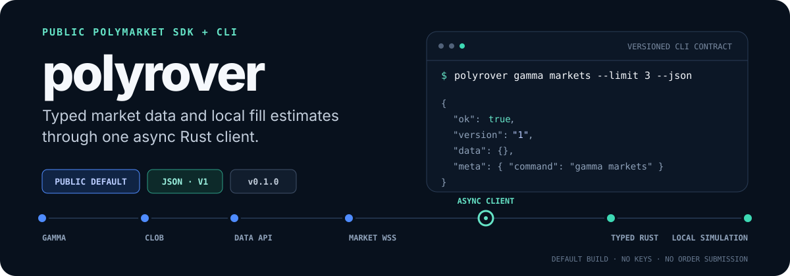
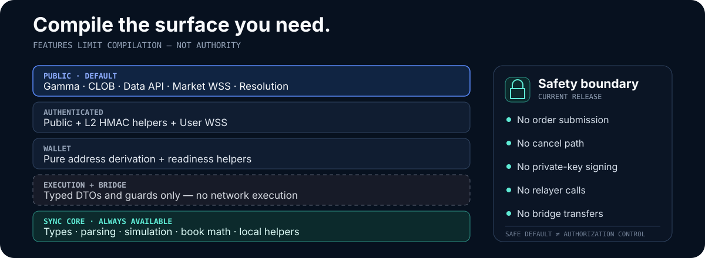

<p align="center">
  
</p>

<p align="center">
  <a href="#quick-start">Quick start</a> ·
  <a href="#what-you-can-do">What you can do</a> ·
  <a href="#simulation-and-fees">Simulation and fees</a> ·
  <a href="#rust-library">Rust library</a> ·
  <a href="#safety-boundary">Safety boundary</a>
</p>

**Polyrover is a Rust CLI and async library for reading public Polymarket data
and testing hypothetical fills locally.** It discovers markets, reads order
books and public account activity, streams market events, and returns versioned
JSON for scripts and agents.

The default install cannot sign, place, or cancel orders. It does not need a
private key.

## Quick start

Polyrover is not on crates.io yet, so install it from Git:

```bash
cargo install --git https://github.com/TrebuchetDynamics/polyrover
```

Check connectivity, then find a market:

```bash
polyrover ping --json
polyrover gamma search --query bitcoin --limit 3 --json
```

Copy one outcome token ID from a returned market's `clob_token_ids`, then inspect
its book and estimate a $5 taker buy:

```bash
TOKEN_ID=<OUTCOME_TOKEN_ID>

polyrover clob book --token-id "$TOKEN_ID" --json
polyrover clob simulate \
  --token-id "$TOKEN_ID" \
  --side buy \
  --amount 5 \
  --fee-category crypto \
  --json
```

For buys, `--amount` is USDC book notional. For sells, it is the number of
shares. The estimated fee is reported separately from the requested amount.

A fee-aware result uses this shape (abbreviated):

```json
{
  "ok": true,
  "version": "1",
  "data": {
    "token_id": "tok",
    "side": "buy",
    "input_amount": "5",
    "input_amount_type": "usdc",
    "complete": true,
    "filled_size": "9",
    "notional": "5",
    "average_price": "0.555556",
    "estimated_taker_fee": "0.154",
    "fee_category": "crypto",
    "unfilled_amount": "0"
  },
  "meta": {
    "command": "clob simulate"
  }
}
```

`complete` tells you whether the selected book levels covered the whole input.
`filled_size` is the estimated share quantity; `estimated_taker_fee` is the
separate USDC fee estimate. This is a snapshot calculation, not a future-fill
guarantee.

## What you can do

| Goal | Command or API |
| --- | --- |
| Find markets and events | `gamma search`, `gamma markets` |
| Read prices and liquidity | `clob price`, `clob book` |
| Inspect fees and order types | `clob fees`, `clob fee-rate` |
| Estimate a taker fill | `clob simulate` |
| Read public positions and trades | `analytics positions`, `analytics trades` |
| Watch live public market events | `stream watch` |
| Use the same data from Rust | `Client` over Gamma, CLOB, Data API, and market WSS |

All CLI successes and failures use the same JSON envelope. `version: "1"`
versions that envelope; nested upstream payload types remain pre-1.0.

### When to use Polyrover

Use Polyrover when you want a small public-data process, typed Rust models,
agent-friendly JSON, or local execution research without installing a live
trading path.

Use Polymarket's broader
[official Rust SDK v2](https://github.com/Polymarket/rs-clob-client-v2) when you
need supported authentication, order management, or production trading.
Polyrover is not a trading bot and does not decide what, when, or how much to
trade.

## Simulation and fees

`clob simulate` walks the current order-book snapshot:

- A **buy** consumes asks from lowest to highest price.
- A **sell** consumes bids from highest to lowest price.
- `--limit-price` stops at worse prices; the boundary price is included.
- `complete: false` means eligible liquidity was insufficient.
- Invalid, non-positive, or non-finite book levels are ignored.
- Results include consumed levels, average and worst price, notional, slippage,
  book hash, and timestamp when available.

It does not model latency, queue position, future book changes, tick rounding,
minimum order size, or stale data. Calculations use validated decimal strings
converted to `f64`; fill values use six decimal places.

### Fee-aware estimates

Polymarket's [fee documentation](https://docs.polymarket.com/trading/fees) says
makers pay no trading fee. Taker fees use:

```text
fee = shares × taker_fee_rate × price × (1 - price)
```

| Market category | Formula coefficient |
| --- | ---: |
| Crypto | `0.07` |
| Sports, economics, culture, weather, other/general | `0.05` |
| Finance, politics, mentions, tech | `0.04` |
| Geopolitics/world events | `0` |

These values are formula coefficients, not percentage labels. Polyrover applies
the formula to each consumed price level and rounds the total to five decimal
places in USDC.

```bash
# Offline guide: current schedule, maker rebates, formula, and order types.
polyrover clob fees --json

# Live CLOB metadata for one token, normalized as base_fee_bps.
polyrover clob fee-rate --token-id "$TOKEN_ID" --json

# Local fill estimate using the documented category coefficient.
polyrover clob simulate \
  --token-id "$TOKEN_ID" \
  --side buy \
  --amount 5 \
  --fee-category crypto \
  --json
```

`base_fee_bps` and the category formula coefficient are different fields; do
not substitute one for the other. Polyrover does not infer a token's category,
so omit `--fee-category` for the legacy fee-free estimate or supply the category
explicitly.

### Order types

Polymarket treats every order as a signed limit order. A “market order” is a
limit order priced to match resting liquidity immediately.

| Type | Unfilled amount |
| --- | --- |
| **GTC** — Good Till Cancelled | Rests until filled or cancelled |
| **GTD** — Good Till Date | Rests until its expiration |
| **FOK** — Fill Or Kill | Cancels unless the full size fills immediately |
| **FAK** — Fill And Kill | Fills what is available, then cancels the rest |

A post-only order either rests as a maker or is rejected if it would match
immediately. See Polymarket's
[order lifecycle](https://docs.polymarket.com/concepts/order-lifecycle) for the
authoritative trading behavior. Polyrover documents these types but does not
submit them.

## Rust library

Polyrover's network API is async-only. The default `public` feature is enough for
market discovery, public account data, streaming, and simulation.

```toml
[dependencies]
polyrover = { git = "https://github.com/TrebuchetDynamics/polyrover", default-features = false, features = ["public"] }
tokio = { version = "1", features = ["macros", "rt-multi-thread"] }
```

```rust
use polyrover::{simulation::Request, Client, ClientConfig};

#[tokio::main]
async fn main() -> polyrover::Result<()> {
    let client = Client::new(ClientConfig::default())?;
    let estimate = client
        .simulate_with_fee(
            Request {
                token_id: "TOKEN_ID".into(),
                side: "buy".into(),
                amount: "5".into(),
                limit_price: "0.55".into(),
            },
            "crypto",
        )
        .await?;

    println!(
        "complete={} shares={} fee_usdc={}",
        estimate.complete, estimate.filled_size, estimate.estimated_taker_fee
    );
    Ok(())
}
```

See the [endpoint capability matrix](docs/endpoint-capability-matrix.md) for the
operation-by-operation API and test inventory.

## Safety boundary

The current release supports observation, simulation, reconciliation, and
pre-trade research. It has no order-submission, cancellation, private-key
signing, relayer, or bridge-transfer client.

<details>
<summary><strong>Compile-time feature layers</strong></summary>

<p align="center">
  
</p>

- **`public` (default)** — Gamma, CLOB, Data API, market WSS, and resolution.
- **`authenticated`** — public features plus L2 HMAC helpers and user WSS.
- **`wallet`** — local address derivation and readiness helpers.
- **`execution`** — order and cancellation data types only; no submission transport.
- **`bridge`** — bridge data types and local validation only; no transfer transport.
- **`full`** — compiles every surface above; it does not add runtime authority.

</details>

The machine-readable [`capabilities.json`](capabilities.json) distinguishes
implemented operations, data-types-only surfaces, unsupported behavior, and
planned work.

## Current limits

- No crates.io release; Git installs track a repository revision.
- Simulation uses `f64`, not a domain-safe decimal type.
- A book snapshot cannot predict latency, queue position, or market movement.
- CI uses deterministic local fixtures and has no scheduled public API canary.
- `stream watch` buffers a bounded JSON result rather than emitting JSON Lines.
- Research or backtest output is not evidence of profitability or live readiness.

<details>
<summary><strong>CLI reference</strong></summary>

```text
ping --json
gamma search --query <text> [--limit n] --json
gamma markets [--limit n] --json
clob book --token-id <id> --json
clob price --token-id <id> --side buy|sell --json
clob fee-rate --token-id <id> --json
clob fees --json
clob simulate --token-id <id> --side buy|sell --amount <n> [--limit-price p] [--fee-category category] --json
analytics positions --user <wallet> [--limit n] --json
analytics trades --user <wallet> [--limit n] --json
analytics leaderboard [--limit n] --json
stream watch --token-id <id> [--token-id <id> ...] [--url ws://...] [--limit n] [--seconds s] --json
sim reset [--cash n] --json
sim buy --token-id <id> --price <p> --size <n> --json
sim sell --token-id <id> --price <p> --size <n> --json
```

Run `polyrover help <command>` for options and examples.

</details>

## Develop

```bash
git clone https://github.com/TrebuchetDynamics/polyrover
cd polyrover
cargo test --all-features
cargo clippy --all-targets --all-features -- -D warnings
cargo doc --open
```

Tests use local fixtures and require no live credentials.

## Project references

- [Endpoint and capability matrix](docs/endpoint-capability-matrix.md)
- [ADR-0001: async SDK with safe public default](docs/adr/0001-universal-async-sdk.md)
- [Port and parity roadmap](PORT_PLAN.md)

## License

Licensed under the [MIT License](LICENSE).
